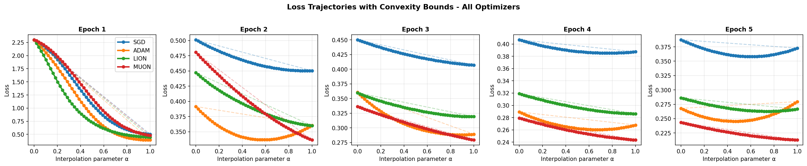

<div align="center">

# A Comparative Analysis of Optimization Trajectories and Convergence Properties

*Geometric analysis of SGD, Adam, Lion and Muon on Fashion-MNIST*

[](https://www.python.org/)
[](https://pytorch.org/)
[](LICENSE)

</div>

---

## Overview

<details>
<summary><strong>Abstract</strong></summary>
<br>

The choice of the optimization algorithm determines training efficiency and generalization of deep neural networks. While methods such as Stochastic Gradient Descent and Adam have become field standards, recent works such as **Lion** and **Muon** promise better convergence properties in practice.

In this paper we present a comparative study of the optimization trajectories produced by SGD, Adam, Lion and Muon applied to a Multi-Layer Perceptron on the Fashion-MNIST dataset. To this end, we use a **linear interpolation method**: for parameters $\vec{\theta}_t$ before and $\vec{\theta}_{t+1}$ after an epoch, we evaluate the loss function at $N=50$ points along the connecting vector, allowing us to empirically verify convexity and smoothness properties along the trajectory.

Furthermore, we evaluate the convergence points $\vec{\theta}$ by testing the first-order characterization of local convexity:

$$f(\vec{\theta}) \leqslant f(\vec{x}) + \nabla f(\vec{\theta})^\top (\vec{\theta} - \vec{x})$$

for points $\vec{x}$ within a neighborhood $B_\varepsilon(\vec{\theta})$.

</details>

This project is a course paper produced as part of **[CS-439 — Optimization for Machine Learning](https://edu.epfl.ch/coursebook/en/optimization-for-machine-learning-CS-439)** at [EPFL](https://www.epfl.ch). It goes beyond standard aggregate metrics (final loss, test accuracy) to study the *geometry* of each optimizer's path through parameter space: local convexity, empirical smoothness, and whether convergence points satisfy optimality conditions.

---

## Key Results

### Performance after 20 epochs

| Optimizer | Learning Rate | Batch Size | Train Loss | Test Accuracy |
|:---------:|:-------------:|:----------:|:----------:|:-------------:|
| SGD       | $10^{-2}$     | 32         | 0.2383     | 88.38 %       |
| Adam      | $10^{-3}$     | 64         | 0.1426     | 88.66 %       |
| Lion      | $10^{-4}$     | 128        | 0.1269     | 88.52 %       |
| **Muon**  | $10^{-3}$     | 64         | **0.0600** | **90.01 %**   |

### Empirical smoothness factor $L$ along the trajectory

| Epoch | SGD    | Adam   | Lion   | Muon   |
|:-----:|:------:|:------:|:------:|:------:|
| 1     | 9.0623 | 9.1043 | 20.157 | 7.3758 |
| 2     | 0.0936 | 0.2062 | 0.1640 | 0.1395 |
| 3     | 0.0872 | 0.4092 | 0.9197 | 0.0470 |
| 4     | 0.0926 | 0.4451 | 0.1061 | 0.0282 |
| 5     | 0.0679 | 0.2878 | 0.1345 | 0.0307 |

> **Muon** not only achieves the best final accuracy but also maintains the lowest smoothness factors from epoch 2 onward, suggesting it finds near-linear "highways" through the loss landscape.

---

## Loss Trajectories

<div align="center">
  
  <p><em>Loss evaluated along the linear interpolation $\vec{\theta}(\alpha) = (1-\alpha)\,\vec{\theta}_t + \alpha\,\vec{\theta}_{t+1}$ for each epoch. Dashed lines show the linear interpolation of endpoint losses.</em></p>
</div>

A clear transition is visible: during **epoch 1** all optimizers traverse non-convex regions (loss dips below the linear baseline), then settle into **locally convex basins** from epoch 2 onward. Muon's trajectory becomes nearly linear — evidence of structurally smoother descent directions provided by its Newton-Schulz orthogonalization step.

---

## Method

The core analysis rests on two tools applied to the checkpointed parameter sequence $\{\vec{\theta}_t\}$:

**1. Linear interpolation & empirical smoothness**

For each consecutive pair $(\vec{\theta}_t, \vec{\theta}_{t+1})$ we evaluate the loss at $N = 50$ evenly-spaced interpolation points and compute:

$$L = \max_i \frac{\|\nabla f(\vec{\theta}_i) - \nabla f(\vec{\theta}_{i+1})\|}{\|\vec{\theta}_i - \vec{\theta}_{i+1}\|}$$

**2. Local optimality check**

At the final parameters $\vec{\theta}$, we sample $K = 50$ perturbations $\vec{x} \in B_\varepsilon(\vec{\theta})$ for four radii $\varepsilon \in \{10^{-2},\, 1,\, \|\nabla f(\vec{\theta})\|,\, 10\|\nabla f(\vec{\theta})\|\}$ and verify:

$$f(\vec{\theta}) \leqslant f(\vec{x}) + \nabla f(\vec{\theta})^\top (\vec{\theta} - \vec{x})$$

This condition held for **all 50 samples, all radii, and all optimizers**, indicating that the final parameters lie in flat, well-behaved basins even at large perturbation scales.

---

## Repository Structure

```
Optml-Project/
├── main.ipynb            # Full experiment: training, trajectory sampling, plots
├── requirements.txt      # Python dependencies
├── data/
│   └── trajectories_cache.pkl   # Cached parameter checkpoints (auto-generated)
└── report/
    ├── main.tex          # LaTeX source
    ├── main.pdf          # Compiled paper
    └── img/              # Figures used in the report
```

---

## Getting Started

### Prerequisites

- Python 3.10+
- pip

### Installation

```bash
git clone https://github.com/OzairFaizan/Optml-Project.git
cd Optml-Project
pip install -r requirements.txt
```

### Running the experiment

Open and run `main.ipynb` end-to-end. The notebook will:

1. Train an MLP on Fashion-MNIST with each optimizer (SGD, Adam, Lion, Muon)
2. Cache the parameter trajectories to `data/trajectories_cache.pkl`
3. Compute interpolation losses, smoothness factors, and the local optimality check
4. Produce all figures

> [!NOTE]
> On first run, trajectory computation may take several minutes depending on your hardware. Subsequent runs load from the cache automatically.

---

## Authors

| Name | Email | Institution |
|------|-------|-------------|
| Ozair Faizan | [ahmad.faizan@epfl.ch](mailto:ahmad.faizan@epfl.ch) | EPFL |
| Paul Tercier | [paul.tercier@epfl.ch](mailto:paul.tercier@epfl.ch) | EPFL |

---

## Citation

If you find this work useful, please cite:

<details>
<summary><strong>BibTeX</strong></summary>

```bibtex
@misc{faizan2025comparative,
  title        = {A Comparative Analysis of Optimization Trajectories and Convergence Properties},
  author       = {Faizan, Ozair and Tercier, Paul},
  year         = {2025},
  note         = {Course project, CS-439 Optimization for Machine Learning, EPFL},
  howpublished = {\url{https://github.com/OzairFaizan/Optml-Project}}
}
```

</details>

---

## License

This project is licensed under the **MIT License** — see the [LICENSE](LICENSE) file for details.

MIT is the standard open license for academic code releases: it allows anyone to use, modify, and distribute the code freely while preserving attribution.
